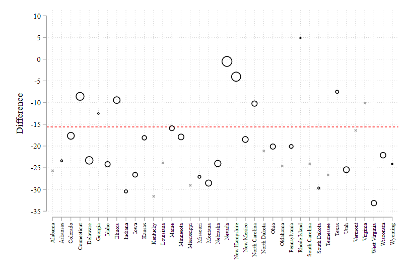
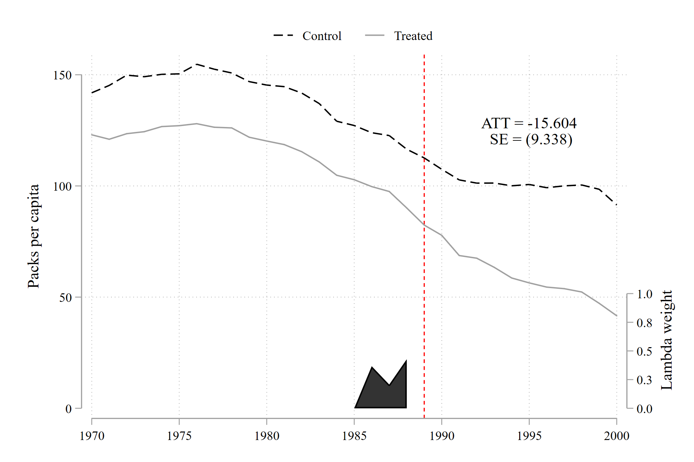

# sdid -- Synthetic Difference-in-Differences for Stata

This Stata package implements the synthetic difference-in-differences estimation procedure, along with a range of inference and graphing procedures, following Arkhangelsky et al., (2021).  Arkhangelsky et al. provide a code implementation in R, with accompanying materials here: [synthdid](https://synth-inference.github.io/synthdid/). 
Here we provide a native Stata implementation, principally written in Mata.  This package extends the funcionality of the original R package, allowing very simply for estimation in contexts with staggered adoption over multiple treatment periods (as well as in a single adoption period as in the original code). 

To install directly into Stata:
```s
ssc install sdid, replace
```
or using ```github``` command:
```s
github install Daniel-Pailanir/sdid
```
## Inputs
+ Y: Outcome variable (numeric)
+ S: Unit variable (numeric or string)
+ T: Time variable (numeric)
+ D: Dummy of treatement, equal to 1 if units are treated, and otherwise 0 (numeric)

## Syntax
```s
sdid Y S T D, vce(method) seed(#) reps(#) covariates(varlist [, method]) graph g1_opt(string) g2_opt(string) unstandardized graph_export([stub] , type)
```
+ vce(): bootstrap, jackknife and placebo standard error.
+ seed(): seed define for pseudo-random numbers.
+ reps(): repetitions for bootstrap and placebo se.
+ covariates(  varlist [, method]): covariates included to adjust Y.  A varlist of covariates should be included, and optionally an option for the method used to adjust.  This can be "optimized" in which case it follows the method proposed by Arkhangelsky et al., or "projected", in which case it follows the procedure proposed by Kranz, 2021 (xsynth in R).  Where method is not specified, optimized is used as default.  Kranz has shown that the projected method is preferable in a number of circumstances.  In this implementation, the projected method is often considerably faster.
+ graph: If this option is specified, graphs will be displayed showing unit and time weights as well as outcome trends as per figure 1 from Arkhangelsky et al.
+ g1_opt() and g2_opt(): option to modify the appearance of the aforementioned graphs.  g1 refers to the unit-specific weight graph, while g2 refers to the outcome trend groaphs. Options requested have to follow the syntax of Stata's twoway_options.
+ unstandardized: If controls are included and the "optimized" method is specified, controls will be standardized as Z-scores prior to finding optimal weights.  This avoids problems with optimization when control variables have very high dispersion.  If unstandardized is specified, controls will simply be entered in their original units.  This option should be used with care.
+ graph_export( [stub], type): Generated graphs can be saved to the disk using this option.  Graphs will be saved as weightsYYYY and trendsYYYY for each of the unit-specific weights and outcome trends respectively, where YYYY refers to each treatment adoption period.  Two graphs will be generated for each treatment adoption period.  If this option is specified, type must be specified, which refers to a valid Stata graph type (eg ".eps", ".pdf", and so forth).  Optionally, a stub can be specified, in which case this will be prepended to exported graph names. 

## Running an example
```s
webuse set www.damianclarke.net/stata/
webuse prop99_example.dta, clear

#delimit ;
sdid packspercapita state year treated, vce(placebo) reps(100) seed(1213) 
     graph g1_opt(xtitle("") ylabel(-35(5)10) scheme(plotplainblind)) 
     g2_opt(ylabel(0(50)150) xlabel(1970(5)2000) ytitle("Packs per capita") 
            xtitle("") text(125 1995 "ATT = -15.604" " SE = (9.209)") scheme(plotplainblind))
    graph_export(sdid_, .png) ;
#delimit cr
```

The code returns the following results

```s
Placebo replications (100). This may take some time.
----+--- 1 ---+--- 2 ---+--- 3 ---+--- 4 ---+--- 5
..................................................     50
..................................................     100


Synthetic Difference-in-Differences Estimator

-----------------------------------------------------------------------------
packsperca~a |     ATT     Std. Err.     t      P>|t|    [95% Conf. Interval]
-------------+---------------------------------------------------------------
   treatment | -15.60383    9.20931    -1.69    0.090   -33.65374     2.44608
-----------------------------------------------------------------------------
95% CIs and p-values are based on Large-Sample approximations.
Refer to Arkhangelsky et al., (2020) for theoretical derivations.
(file sdid_weights1989.eps written in EPS format)
(file sdid_trends1989.eps written in EPS format)
```




<div style="width: 50%; height: 50%">
     
  
     
</div>


### References
Dmitry Arkhangelsky, Susan Athey, David A. Hirshberg, Guido W. Imbens, and Stefan Wager. Synthetic Difference in Differences, American Economic Review, December 2021.
